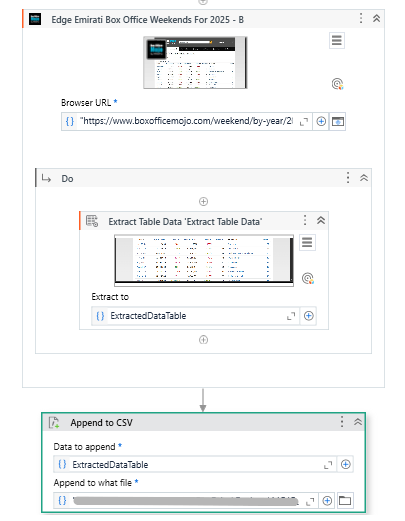

# Box Office Mojo RPA Automation & OMDB API Integration

A comprehensive UiPath RPA workflow with intelligent API integration for automated data extraction from Box Office Mojo and real-time movie metadata enrichment via OMDB API, featuring advanced data preprocessing and cleaning pipeline.

## 📋 Project Overview

This RPA solution automates the complete data pipeline for movie analytics:
1. **RPA Data Extraction**: Intelligent web scraping from Box Office Mojo's website
2. **API Integration**: Seamless OMDB API integration for enriched movie metadata
3. **Data Processing**: Comprehensive preprocessing and cleaning for analysis-ready datasets
4. **Automated Export**: Clean, structured data output for downstream applications

## 🖼️ Workflow Screenshot



*Box Office Mojo RPA Data Extraction Workflow*

## 🎯 Features

### Core RPA Automation Features
- **Intelligent Web Navigation**: Automated browser control and navigation to Box Office Mojo pages
- **Dynamic Data Extraction**: Advanced table scraping with adaptive selectors
- **Multi-Country Support**: Scalable extraction across different geographical regions
- **Error Handling**: Robust exception handling and retry mechanisms

### Advanced API Integration
- **OMDB API Integration**: Real-time movie genre enrichment
- **Rate Limiting Management**: Intelligent request throttling (0.5s delays)
- **Error Handling**: Robust API response validation with fallback values
- **Batch Processing**: Efficient handling of unique movie titles to avoid duplicate requests

### Automated Data Processing
- **Date Standardization**: Automated date format conversion (YYYY-MM-DD)
- **Data Type Optimization**: Smart conversion of percentages and currency values
- **Missing Value Handling**: Intelligent imputation and data quality management
- **Export Automation**: Seamless CSV generation and file management

## 🛠️ Technical Requirements

### Software Dependencies
- **UiPath Studio** (Latest version recommended)
- **UiPath Robot** for execution
- **Modern web browser** (Chrome/Edge recommended)
- **Python** (for OMDB API integration and data preprocessing)

### UiPath Packages Required
- `UiPath.WebAPI.Activities`
- `UiPath.Excel.Activities`
- `UiPath.System.Activities`
- `UiPath.UIAutomation.Activities`

### Python Dependencies
```python
pip install pandas requests openpyxl
```

### API Requirements
- **OMDB API Key**: Register at [OMDB API](http://www.omdbapi.com/) for movie metadata access

## 🔧 Complete Workflow Process

### Phase 1: RPA Automation
1. **Initialize** - Set up browser automation environment
2. **Navigate** - Intelligent navigation to Box Office Mojo pages
3. **Extract** - Dynamic table extraction with error handling
4. **Store** - Raw data storage in structured format

### Phase 2: Data Preprocessing
1. **Format Standardization** - Date formatting (YYYY-MM-DD)
2. **Data Cleaning** - Remove inconsistencies and format data
3. **Validation** - Quality checks and data integrity verification

### Phase 3: OMDB API Integration
1. **API Configuration** - Set up OMDB API credentials and rate limiting
2. **Genre Extraction** - Automated movie genre enrichment:
   ```python
   # Function to fetch genre using OMDb API
   def get_genre(title):
       url = f"http://www.omdbapi.com/?t={title}&apikey={API_KEY}"
       response = requests.get(url)
       data = response.json()
       return data.get('Genre', 'Not found')
   
   # Map genres to dataframe
   df['Genre'] = df['#1 Release'].map(lambda x: genre_lookup.get(str(x).strip(), 'Not found'))
   ```
3. **Data Merging** - Intelligent integration of API responses with scraped data

### Phase 4: Advanced Processing & Export
1. **Data Optimization** - Column management and unnecessary data removal
2. **Type Conversion** - Automated percentage and currency formatting
3. **Missing Value Handling** - Smart imputation strategies
4. **Export** - Clean, analysis-ready data output

## 🚀 Setup Instructions

### 1. Environment Setup
```bash
# Install UiPath Studio
# Install Python and required packages
pip install pandas numpy requests tqdm

# Set up browser automation
# Verify internet connectivity
```

### 2. API Configuration
1. Register for OMDB API key at http://www.omdbapi.com/
2. Create `Config/config.json`:
```json
{
    "omdb_api_key": "your_api_key_here",
    "output_path": "Data/",
    "delay_between_requests": 1
}
```

### 3. Project Configuration
1. Clone or download the project files
2. Open `Main.xaml` in UiPath Studio
3. Update the target URL if needed
4. Configure output file paths
5. Set up Python script paths in UiPath workflow

## ▶️ Execution Steps

### Complete Pipeline Execution
1. **Run RPA Extraction**:
   - Open UiPath Studio
   - Load `Main.xaml` workflow
   - Execute data extraction process

2. **Run API Integration**:
   ```bash
   # Using Jupyter Notebook
   jupyter notebook Scripts/INTEGRATING_MOJO_DATA_OMDB_API.ipynb
   
   # Or run as Python script
   python Scripts/omdb_integration.py
   ```

3. **Verify Output**:
   - Check `updated_with_genres.xlsx` for genre-enriched dataset
   - Validate API response quality and data completeness

### Automated Execution
1. Create batch script combining RPA and Python processing
2. Schedule via UiPath Orchestrator or system scheduler
3. Set up monitoring and error notifications

## 📊 Data Output

### Enhanced Dataset Structure
The processed dataset includes:

#### Original Box Office Data
- Movie titles, rankings, revenue figures
- Weekend performance metrics
- Country-specific data

#### OMDB Enriched Data
- **Genre**: Movie genres (comma-separated) from OMDB API
- **API Status**: Success/failure indicators for API calls

#### Processed Fields
- **Standardized Dates**: YYYY-MM-DD format
- **Numeric Values**: Clean float representations of percentages and currency
- **Quality Indicators**: Data completeness and validation flags

### File Outputs
- **Raw Data**: `Data/MOJO_ALL.csv`
- **Genre-Enriched Data**: `updated_with_genres.xlsx`
- **Processing Log**: Console output with API call results

## 🔍 Troubleshooting

### RPA Issues
**Browser Not Opening**
- Verify browser installation and UiPath extensions
- Update browser drivers

**Data Not Extracting**
- Check website structure changes
- Update CSS selectors

### API Issues
**OMDB API Errors**
- Verify API key validity and format
- Check rate limiting (1000 requests/day for free tier)
- Handle "Not found" responses for obscure movie titles
- Monitor API response format changes

**Data Processing Errors**
- Check pandas and requests library compatibility
- Verify CSV file encoding and format
- Review unique movie title extraction
- Handle special characters in movie titles

### Performance Optimization
- Implement caching for OMDB requests
- Use batch processing for large datasets
- Add progress tracking for long-running operations

## 📈 Applications & Use Cases

### Data Science & Analytics
The genre-enriched dataset enables:
- **Genre Performance Analysis**: Revenue trends across different movie categories
- **Market Segmentation**: Understanding audience preferences by genre
- **Content Strategy**: Genre-based decision making for distributors
- **Competitive Analysis**: Genre performance across different markets
- **Predictive Modeling**: Genre as a feature for box office prediction models

### Business Intelligence
- **Market Intelligence**: Genre-based competitive analysis and industry insights
- **Content Acquisition**: Data-driven genre selection for distributors
- **Release Strategy**: Genre performance optimization across regions
- **Investment Decisions**: Genre-focused portfolio analysis

## 🔄 Maintenance & Updates

### Regular Maintenance
- **API Key Management**: Monitor OMDB API usage limits
- **Selector Updates**: Maintain web scraping reliability
- **Data Quality Monitoring**: Regular validation checks
- **Performance Optimization**: Monitor processing times

### Data Quality Assurance
- Automated data validation rules
- Missing value monitoring
- Outlier detection and handling
- Cross-reference validation with external sources

## 📝 Future Enhancements

### Planned Enhancements
1. **Multi-API Integration**: TMDb, Rotten Tomatoes, and other movie databases
2. **Advanced RPA Features**: Parallel processing and dynamic country selection
3. **Real-time Monitoring**: Live data extraction and processing capabilities
4. **Cloud Deployment**: AWS/Azure automation and API management
5. **Machine Learning Pipeline**: Automated feature engineering and model training
6. **Advanced Error Recovery**: Sophisticated retry mechanisms and fallback strategies

### RPA & API Optimization
- **Intelligent Scheduling**: Dynamic extraction timing based on data freshness
- **API Caching**: Redis/database caching for repeated requests
- **Distributed Processing**: Multi-bot RPA execution
- **Performance Monitoring**: Real-time automation metrics and alerting

## 🤝 Contributing

### Development Guidelines
1. Fork the repository
2. Create feature branch for new functionality
3. Test with sample datasets
4. Document API changes and new features
5. Submit pull request with comprehensive testing

### Code Standards
- Follow PEP 8 for Python code
- Include error handling and logging
- Add unit tests for new functions
- Update documentation for changes

## 📄 License & Compliance

This project is for educational and research purposes. Ensure compliance with:
- Box Office Mojo's terms of service
- OMDB API usage policies
- Data privacy regulations
- Fair use guidelines for commercial applications

---

**Maintained by**: snowflakelogic  
**Last Updated**: June 2025  
**Focus**: Automated Data Extraction & API Integration Pipeline
